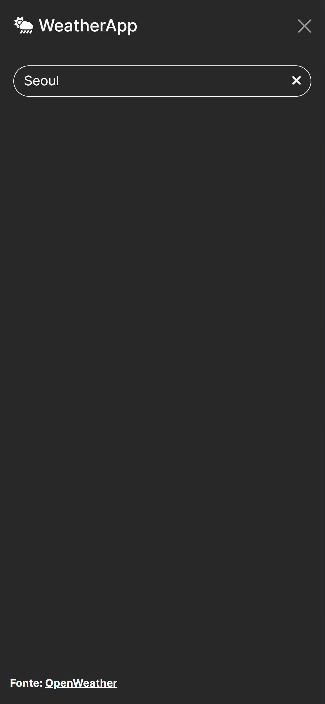

### PT-BR

# App de Previsão do Tempo *(Weather App)*

## Objetivo
- Desenvolver habilidades de desenvolvimento web frontend e a integração de APIs.
- Esta aplicação foi criada com fins de estudo.

## Características

- Ver as condições meteorológicas atuais para qualquer local do mundo.
- Dados meteorológicos: temperatura, umidade, velocidade do vento e muito mais.
- Interface de usuário limpa e intuitiva.
- Design responsivo para uso em desktops e dispositivos móveis.

## Screenshots

<div style="display: flex;">
  
  
</div>

## Tecnologias usadas

- HTML5
- CSS3
- Bootstrap
- JavaScript
- [OpenWeather API](https://openweathermap.org/api) - Utilizada para buscar os dados meteorológicos.

## Uso
- Digite uma cidade de qualquer local do mundo na barra de pesquisa.
- A pesquisa é iniciada ao apertar o botão 'enter'.
- As informações do tempo para a localidade serão mostradas*.

*Os cards que indicam a semana e alertas ainda não contam com updates da API.

## Instalação

1. Clone o repositório abaixo caso queira usar este projeto:

   ```bash
   git clone https://github.com/resendeleonardo/weather-app.git

2. Vá para a pasta do projeto.
   ```bash
   cd weather-app

3. Abra `index.html` no seu navegador ou `localhost:8080/weather-app/` caso crie um servidor `http` local, neste último caso você poderá criar o servidor com o código abaixo:
   ```bash
   http-server -p 0

## License

This project is licensed under the MIT License - see the [LICENSE](LICENSE) file for details.
