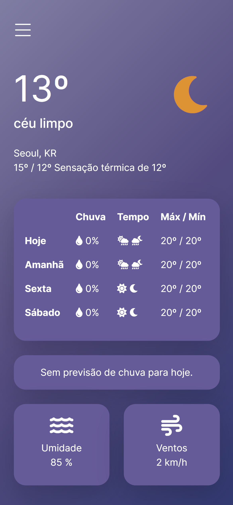

# Weather App

A simple web application for a responsive Weather App built with HTML, CSS, and JavaScript.

## Introduction

This project is a basic, yet fully responsive and interactive Weather App utilizing JavaScript and API integration. The goal is to fetch weather data from an API and render this data into our user interface.

## Features

- View current weather conditions for any location worldwide.
- Weather data: temperature, humidity, wind speed, and more.
- Clean and intuitive user interface.
- Responsive design for use on desktops and mobile devices.

## Screenshots

<div style="display: flex;">
  
  
  
</div>

## Technologies Used

- HTML5
- CSS3
- Bootstrap
- JavaScript
- [OpenWeather API](https://openweathermap.org/api) - Used to retrieve weather data.

## Usage

- Enter the name of any city worldwide in the search bar.
- Press the 'Enter' key to initiate the search.
- Weather information for the specified location will be displayed*.

*Note: The cards indicating the week and alerts do not yet receive updates from the API.

## Installation

1. Clone the repository if you want to use this project:

   ```bash
   git clone https://github.com/resendeleonardo/weather-app.git

2. Navigate to the project folder.
   ```bash
   cd weather-app

3. Open `index.html` in your browser or `localhost:8080/weather-app/` if you create a local `http` server. In the latter case, you can create the server using the code below:
   ```bash
   http-server -p 0

## License

This project is licensed under the MIT License - see the [LICENSE](LICENSE) file for details.
